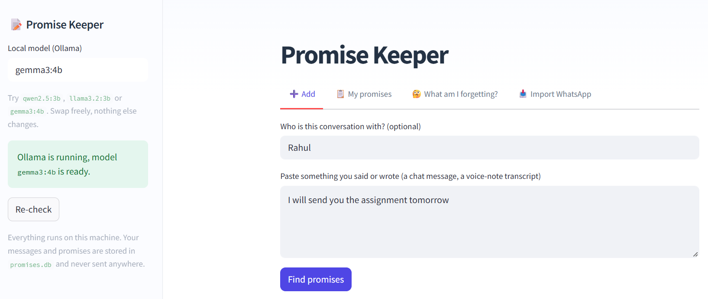

# 📝 Promise Keeper

> Built for a friend for the Hacktoberfest Weekend Challenge: *Build for a Friend*.

A local-first assistant that remembers what you promised people. Paste a message
("I'll send you the report tonight" or "Kal subah main tumhe call karunga"), confirm what it found,
and later ask **"What am I forgetting?"**

<!-- Add a screenshot or GIF: 
-->
 

**Open-source core:** an open-weight model ([Gemma 3](https://ai.google.dev/gemma)) running locally through
[Ollama](https://ollama.com), with storage in SQLite. No API keys, no accounts, works with Wi-Fi off.
Your messages and relationships never leave your machine.

## Run it

Requires **Python 3.10+** and [Ollama](https://ollama.com).

```bash
# 1. Pull a small open-weight model
ollama pull gemma3:4b

# 2. Install and configure
python -m venv .venv && source .venv/bin/activate      # Windows: .venv\Scripts\activate
pip install -r requirements.txt
cp .env.example .env                                   # Windows: copy .env.example .env

# 3. Start the app
streamlit run app.py
```

Settings live in `.env` (git-ignored). No API keys are needed:

```
PK_MODEL=gemma3:4b
OLLAMA_HOST=http://localhost:11434
```

Real environment variables override `.env`, so `PK_MODEL=qwen2.5:3b streamlit run app.py` works too, and you can
also type another model name in the sidebar. The sidebar shows whether Ollama and the model are reachable.

## Try it

Paste these in the **Add** tab:

- `Sure, I'll send you the project report tonight.`
- `Kal subah main tumhe call karunga`
- `I'll call mom tomorrow morning and pay the electricity bill by Friday.`

These should find nothing: `Haha that movie was so good`, `I won't be able to make it tomorrow, sorry`.

## Features

- **Paste a message → promises.** English and Hinglish ("kal subah", "aaj raat", "5 baje").
- **Import a WhatsApp chat export.** Only *your* lines are scanned, and "tomorrow" is resolved
  relative to when you *said* it, so old promises correctly show up as overdue.
- **You confirm everything.** Date/time pickers, edit any promise later, undo "done".
- **Group by status or by person** ("what do I owe Rahul?"), plus a weekly "you kept 7 of 9" summary.
- **Draft a nudge** for an overdue promise, written by the local model from the facts only.
- **"What am I forgetting?"** is a database query, never the model's memory.

## How it works

```
message --> local LLM (JSON-schema output) --> commitment, person, deadline *phrase*
                                                        │
                       dates.py resolves "tonight" / "by Monday" deterministically
                                                        │ 
                       you confirm / edit  -->  SQLite  -->  "What am I forgetting?"
```

Design choices:

- **The model never does date maths.** Small models are bad at it, so it only copies the phrase
  ("by Monday"); `promise_keeper/dates.py` turns it into a datetime and is unit-tested.
- **The model never answers "what am I forgetting?" from memory.** The answer is a SQL query; the
  model may optionally reword it, but it can't add or drop items.
- **Human in the loop:** nothing is saved until you confirm the extracted promise.
- **"No promise here" is a valid answer**, so ordinary chat doesn't create fake promises.

## Why open models?

A promise tracker reads your private conversations: who you talk to and what you owe them.
With a local open-weight model:

- Nothing leaves the machine. It works in airplane mode.
- It costs nothing to run, so scanning a year of chat history is fine.
- Models are swappable in one line, which let me measure Gemma against Qwen on my own cases instead of
  accepting whatever one vendor offers.

## Test and compare models

```bash
pytest                                                          # 55 tests, no model needed
python scripts/evaluate.py gemma3:4b qwen2.5:3b llama3.2:3b     # scores each model on tests/cases.json
```

`evaluate.py` prints a per-category breakdown (`core`, `hinglish`, `edge`) and a Markdown table.
To add your own messages, edit `tests/cases.json` (with permission, names removed).

### Results

20 labelled messages: 13 core, 3 Hinglish, 4 edge cases (negation, conditionals, past tense).

| Model | Right # of promises | Deadlines | core | edge | hinglish | Avg s/msg |
|---|---|---|---|---|---|---|
| `gemma3:4b` | 17/20 | 20/20 | 11/13 | 3/4 | 3/3 | 8.3 |
| `qwen2.5:3b` | 18/20 | 20/20 | 11/13 | 4/4 | 3/3 | 3.6 |

**What this shows**

- The two models are effectively tied on accuracy. With 20 cases, a one-case gap is not evidence that
  either is better. Both got every deadline and every Hinglish case right.
- Qwen was about twice as fast per message, which matters when importing a long chat.
- Both made the same two mistakes: treating a *request* ("Can you send me the notes by tonight?") and
  *someone else's action* ("Rahul will send the files tomorrow") as the user's own promises.
  Gemma also extracted a past-tense statement ("I sent you the report yesterday").
  These are prompt weaknesses rather than model weaknesses, which is why every extraction is confirmed by a human.

Timings come from one machine and include model warm-up, so treat them as rough.

## Limitations

- Small local models make mistakes, which is why you confirm everything before it's saved.
- WhatsApp import checks only the latest 60 lines that look like promises, and the keyword
  pre-filter can miss unusual phrasing.
- Date handling covers English and Hinglish. Other languages need word lists added to `dates.py`.
- The evaluation set is small (20 cases), so the numbers are indicative only.

## Layout

```
app.py                  Streamlit UI
.env.example            settings template (copy to .env)
promise_keeper/
  config.py             settings + .env loader
  llm.py                Ollama wrapper + health check
  whatsapp.py           chat-export parser + cheap promise pre-filter
  prompts.py            all prompt text
  extractor.py          message -> structured promises
  dates.py              deadline phrase -> datetime
  db.py                 SQLite storage
  report.py             "What am I forgetting?", stats, nudges
scripts/evaluate.py     model comparison
tests/                  pytest suite + labelled cases
```

## Ideas for next steps

Voice-note input with Whisper, desktop notifications for overdue items, fine-tuning a small model
on Hinglish promises, Telegram/Signal importers. See `CONTRIBUTING.md`.

## License

MIT, see `LICENSE`.
